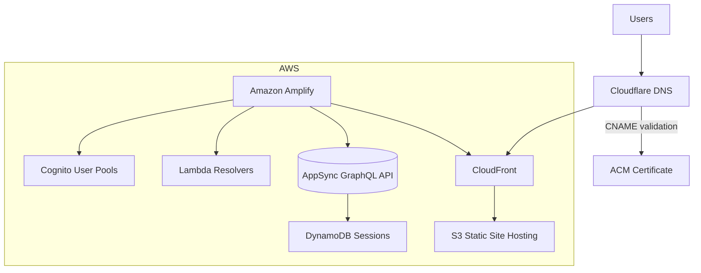

**TL;DR** — I just overhauled **MikePFunk.com** and shipped **Mnemonics App**, a flash‑card style study helper that runs on a fully‑managed serverless stack.  The twist?  The app lives on AWS, but the domain remains on Cloudflare, so I had to stitch the two together with DNS validation, an ACM certificate, and a CloudFront distribution.  Here's how it all fits.

## Why the Re‑build?

1. **Performance** – Static HTML + global CDN beats my old WordPress every time.
2. **Developer Happiness** – Amplify + SAM CLI = hot‑reloading Lambda functions and GraphQL schemas in seconds.
3. **Security** – Cognito User Pools handle auth; no more rolling my own login forms.

## Meet *Mnemonics App*

A distraction‑free web app that helps you memorize anything by creating spaced‑repetition flash cards.

* **Create decks** in plain language.
* **Auto‑generated mnemonics** using LLM prompts.
* **Adaptive scheduling** so harder cards show up more often.

## Architecture at a Glance




## The Multi‑Cloud Dance

### Domain Validation & Certificate Issuance

| Step | Action | Service |
| ---- | ------ | ------- |
| 1 | Amplify requests a **public certificate** in `us-east-1`. | ACM |
| 2 | ACM spits out a *unique CNAME* token for each host name. | ACM |
| 3 | I add those CNAMEs to **Cloudflare DNS** (grey‑clouded). | Cloudflare |
| 4 | ACM polls public DNS, sees the token, marks the domain *validated* and issues the cert. | ACM |

### CloudFront + Cloudflare TLS Handshake

```text
Browser  ── TLS #1 ─▶ Cloudflare (Universal SSL)
                     │
Cloudflare ── TLS #2 ─▶ CloudFront (ACM cert)
                     │
CloudFront ── HTTP ▶  Amplify‑hosted app
```

* **Full (Strict)** mode ensures Cloudflare speaks HTTPS to CloudFront.
* The certificate you just validated is what CloudFront presents during TLS #2.

### Edge Caching & Latency

* **CloudFront** short‑circuits trips to S3/Lambda by caching at 400+ PoPs.
* **Cloudflare** adds an extra layer of shielding, DDoS protection, and quick DNS propagation.

## AWS Bits Under the Hood

| Service                | What it does                                                                            |
| ---------------------- | --------------------------------------------------------------------------------------- |
| **Amplify Hosting**    | CI/CD pipeline + S3 origin + managed CloudFront distribution                            |
| **SAM CLI**            | Local builds of Lambda & AppSync, then `sam deploy --guided` straight to CloudFormation |
| **Cognito User Pools** | Sign‑up, sign‑in, tokens; hooked into Amplify's `Auth` module                           |
| **AppSync**            | Managed GraphQL backend; Lambda resolvers add server‑side logic                         |
| **DynamoDB**           | Stores per‑user deck progress and spaced‑repetition schedule                            |
| **S3**                 | Hosts the React front‑end and keeps user‑generated images (mnemonic illustrations)      |
| **ACM**                | Issues the TLS cert, renews it automatically every 13 months                            |

## What's Next

* **Offline PWA mode** so decks sync when connectivity returns.
* **Custom mnemonic generator** powered by an on‑device LLM for privacy‑first study sessions.
* **Public deck marketplace** with Lambda\@Edge to geo‑target popular subjects.

---

### Try It!

1. Head to **[https://mikepfunk.com](https://mikepfunk.com)** (should load in \~100 ms from most regions).
2. Create a free account & make your first deck.
3. Tweet me your feedback → [@MikePFunk28](https://twitter.com/MikePFunk28).

–– Mike
